# Code Q&A

Ask questions about any public GitHub repository and get answers that cite the exact files and lines they come from.

[](https://github.com/pierre-yves-lelievre/code-qa-service/actions/workflows/ci.yml)

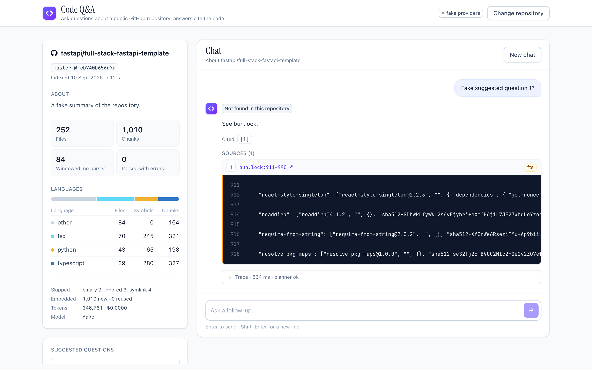

---

## Overview

Understanding an unfamiliar codebase means grep, guesswork, and reading until something clicks. This service does the reading. Point it at a public repository: it clones the code, parses it into functions and classes with tree-sitter, embeds every chunk with Voyage's code model, and stores the lot in Postgres. Then you ask in plain English. A small planner call turns the question into a search, three retrieval legs run in parallel (exact symbol names, keyword search, vector similarity), and Claude answers from the retrieved code only, citing it. Every citation is checked against what the model was actually shown, and every source links to GitHub at the indexed commit and the cited lines.

It runs from one `docker compose up`. With `PROVIDERS=fake` it runs with no API keys at all, which is how it was built and tested; the real providers switch on with one variable. This is the Newpage take-home, Option 2. The brief asked for a solid, well-engineered basic solution over a complex one, and that was the bar.

---

## Quick start

### Docker (recommended)

```bash
cp .env.example .env     # PROVIDERS=fake by default: no keys needed
docker compose up --build
```

Open **http://localhost:8000**. Search for a repository, index it, ask.

### Real providers

Set `PROVIDERS=real` in `.env` and add two keys:

| Key | Where | What the demo costs |
|---|---|---|
| `VOYAGE_API_KEY` | [dash.voyageai.com](https://dash.voyageai.com) | Indexing the demo repo is ~350k tokens: about $0.04 at list price, inside the free allowance |
| `ANTHROPIC_API_KEY` | [platform.claude.com](https://platform.claude.com) | About $0.05 per question, $0.02 per index for the summary |

`make smoke` costs under $0.10. A full `make eval` including the index is about $0.25.

### Local

```bash
make install   # uv sync --all-groups
make db        # Postgres + pgvector in Docker, plus the codeqa_test database
make web       # build the React page into app/static
make run       # uvicorn with --reload on :8000
```

Pre-commit runs `gitleaks` from a pinned Docker image, so Docker must be running to commit.

### Search → index → ask

```bash
# 1. Find a repository (GitHub search, proxied and pre-checked for size)
curl -s 'localhost:8000/repos/search?q=markupsafe' | jq '.items[0]'
# {
#   "full_name": "pallets/markupsafe",
#   "description": "Safely add untrusted strings to HTML/XML markup.",
#   "stars": 697,
#   "language": "Python",
#   "size_kb": 1033,
#   "default_branch": "main",
#   "url": "https://github.com/pallets/markupsafe"
# }

# 2. Index it — returns immediately with a job id
curl -s -X POST localhost:8000/index \
  -H 'Content-Type: application/json' \
  -d '{"url":"https://github.com/pallets/markupsafe"}' | jq
# { "job_id": "47f29342-4d45-4fad-b79c-276b8e2a6c68", "repo_id": 1, "owner": "pallets",
#   "name": "markupsafe", "branch": "main", "status": "pending" }

# 3. Poll until succeeded
curl -s localhost:8000/index/47f29342-4d45-4fad-b79c-276b8e2a6c68 | jq '{status, progress}'
# { "status": "running",
#   "progress": { "stage": "parsing", "files_done": 46, "files_total": 46, "chunks": 169 } }

# 4. Ask
curl -s -X POST localhost:8000/ask \
  -H 'Content-Type: application/json' \
  -d '{"repo_id":1,"question":"How does escape() decide whether to call __html__?"}' | jq
# { "answer": "In `src/markupsafe/__init__.py`, the `escape` function first checks `type(s) is str`
#              and, if so, skips `__html__` entirely and just runs `_escape_inner` on it directly…",
#   "not_found": false,
#   "sources": [ { "path": "src/markupsafe/__init__.py", "start_line": 24, "end_line": 45,
#                  "kind": "function", "qualname": "src.markupsafe.escape", "tier": "symbol" } ],
#   "timings": { "plan_ms": 2359, "retrieve_ms": 455, "llm_ms": 7684, "total_ms": 10517 },
#   "tokens":  { "input": 7105, "output": 751, "cache_read": 1167, "cache_write": 0 },
#   "query_id": 4 }
```

---

## API reference

| Method | Path | Purpose |
|--------|------|---------|
| `GET` | `/health` | Database, pgvector, provider mode, key presence |
| `GET` | `/repos/search?q=` | GitHub repository search: five results with size and language |
| `POST` | `/index` | Index a public repository; returns a job id |
| `GET` | `/index/{job_id}` | Job status and stage progress |
| `GET` | `/repos` | Indexed repositories with their active snapshot |
| `GET` | `/repos/{repo_id}` | Repository, active snapshot, summary, suggested questions |
| `POST` | `/ask` | Answer a question with cited sources |
| `POST` | `/queries/{query_id}/feedback` | Thumbs up or down on an answer |

Full interactive docs at **`http://localhost:8000/docs`** (Swagger UI). Every error is `{"detail": "...", "code": "..."}`; the codes each route can return are listed in the OpenAPI schema.

---

### `GET /health`

```bash
curl -s localhost:8000/health | jq
```
```json
{
  "status": "ok",
  "version": "0.1.0",
  "uptime_seconds": 1415.77,
  "providers": "real",
  "database": { "reachable": true, "vector_available": "0.8.6", "vector_installed": "0.8.6" },
  "keys": { "voyage": true, "anthropic": true, "github": false }
}
```

Returns `503` with `"status": "degraded"` if the database is unreachable or the `vector` extension is not installed. Keys are checked for presence only; `/health` never calls a provider.

---

### `GET /repos/search?q=`

```bash
curl -s 'localhost:8000/repos/search?q=full-stack-fastapi-template' | jq '.items | length'
```

Proxies GitHub's repository search, five results, with `size_kb` and `default_branch` so the UI can refuse an oversized repository before cloning. Unauthenticated GitHub search is rate-limited to ten requests a minute; an optional `GITHUB_TOKEN` lifts it. A 403 from GitHub comes back as `429 github_rate_limited`; GitHub unreachable is `502 github_unavailable`.

---

### `POST /index`

```bash
curl -s -X POST localhost:8000/index \
  -H 'Content-Type: application/json' \
  -d '{"url":"https://github.com/pallets/markupsafe"}' | jq
```
```json
{
  "job_id": "47f29342-4d45-4fad-b79c-276b8e2a6c68",
  "repo_id": 1,
  "owner": "pallets",
  "name": "markupsafe",
  "branch": "main",
  "status": "pending"
}
```

Returns `202 Accepted`. Before the job starts, the URL is validated (`github.com/<owner>/<name>` only, branch may not start with `-`), the repository is looked up through the GitHub API, and its size is checked against `MAX_REPO_MB`. Error codes: `422 invalid_repo_url`, `404 github_repo_not_found`, `413 repo_too_large`, `409 index_in_progress` (a job for this repository is already pending or running), `429 too_many_jobs` (two run at once, globally).

---

### `GET /index/{job_id}`

```bash
curl -s localhost:8000/index/8d6285ff-6ef4-4ca0-a0b5-834e40b9b703 | jq
```
```json
{
  "job_id": "8d6285ff-6ef4-4ca0-a0b5-834e40b9b703",
  "repo_id": 1,
  "status": "running",
  "progress": { "stage": "parsing", "files_done": 46, "files_total": 46, "chunks": 169 },
  "error": null,
  "snapshot_id": 1,
  "created_at": "2026-09-12T15:38:24.953711Z",
  "started_at": "2026-09-12T15:38:24.983912Z",
  "completed_at": null
}
```

`status` transitions `pending → running → succeeded | failed`. Stages: `cloning → walking → parsing → embedding → summarizing → done`. A re-index at a commit that is already active finishes immediately with `"already_indexed": true`. Returns `404 job_not_found` for unknown ids.

---

### `GET /repos/{repo_id}`

```bash
curl -s localhost:8000/repos/2 | jq '{summary, suggested_questions, snapshot: .snapshot.stats}'
```
```json
{
  "summary": "This repository is the Full Stack FastAPI Template, a production-ready starter combining a FastAPI/SQLModel/PostgreSQL backend with a React/TypeScript/Vite/Tailwind frontend served under the same domain…",
  "suggested_questions": [
    "How is the auto-generated frontend API client kept in sync with backend API changes?",
    "What is the authentication flow, and how are JWT tokens issued, validated, and refreshed?",
    "How are the Docker Compose configurations (compose.yml, compose.override.yml, compose.deploy.yml) differentiated for local development versus production deployment?",
    "How are database migrations managed with SQLModel, and where are they defined in the backend directory?"
  ],
  "snapshot": {
    "files": 252, "chunks": 991, "seconds": 24.22, "files_with_parse_errors": 0,
    "by_language": { "python": { "files": 43, "symbols": 165, "chunks": 198 }, "tsx": { "…": "…" } },
    "skipped": { "binary": 9, "ignored": 4, "symlink": 4 },
    "embedding": { "model": "voyage-code-4", "embedded": 0, "reused": 991, "tokens": 0, "cost_usd": 0.0 },
    "summary": { "status": "ok", "input_tokens": 1885, "output_tokens": 377 }
  }
}
```

---

### `POST /ask`

```bash
curl -s -X POST localhost:8000/ask \
  -H 'Content-Type: application/json' \
  -d '{"repo_id":2,"question":"Where is the login endpoint defined?"}' | jq
```
```json
{
  "answer": "## Backend\n\nThe login endpoint is defined in `backend/app/api/routes/login.py`, in the function `login_access_token`, registered as `@router.post(\"/login/access-token\")`…",
  "not_found": false,
  "sources": [
    {
      "path": "backend/app/api/routes/login.py",
      "start_line": 23, "end_line": 42,
      "kind": "function",
      "qualname": "backend.app.api.routes.login.login_access_token",
      "tier": "vector",
      "excerpt": "def login_access_token( session: SessionDep, form_data: Annotated[OAuth2PasswordRequestForm, Depends()] ) -> Token\n@router.post(\"/login/access-token\")…",
      "github_url": "https://github.com/fastapi/full-stack-fastapi-template/blob/cb740b656d7a…/backend/app/api/routes/login.py#L23-L42",
      "cited": true
    }
  ],
  "retrievers": {
    "symbol": { "status": "ok", "hits": 23, "ms": 19 },
    "fts":    { "status": "or_fallback", "hits": 50, "ms": 8 },
    "vector": { "status": "ok", "hits": 20, "ms": 428 },
    "planner": "ok"
  },
  "timings": { "plan_ms": 2137, "embed_ms": 415, "retrieve_ms": 455, "llm_ms": 8090, "total_ms": 10702 },
  "tokens":  { "input": 6811, "output": 878, "cache_read": 0, "cache_write": 1213 },
  "snapshot": { "commit_sha": "cb740b656d7a…", "indexed_at": "2026-09-11T15:36:25.931348Z" },
  "notes": [],
  "conversation_id": "209839a1-6883-4864-9ee4-96813e0df32b",
  "query_id": 52
}
```

Pass the returned `conversation_id` on the next call to continue the thread; the last four turns are replayed to the model with the sources they cited. `not_found` is `true` when the relevance floor fired, when no sources were retrieved (no model call is made), or when the model said so. Errors: `404 repo_not_found`, `409 repo_not_indexed`, `422` on an empty or over-long question, `502 provider_error`.

---

### `POST /queries/{query_id}/feedback`

```bash
curl -s -X POST localhost:8000/queries/4/feedback \
  -H 'Content-Type: application/json' -d '{"feedback":"down"}' | jq
```
```json
{ "query_id": 4, "feedback": "down" }
```

Stored against the query. The eval tooling lists thumbs-down rows as candidate golden cases.

---

## Use it as a tool from Claude Code or Cursor

The same `ask()` is exposed as an MCP server, so an agent can use this service as a tool rather than the service trying to be an agent.

```bash
make run                                    # the service, in another terminal
claude mcp add code-qa -- uv run python -m app.mcp_server
```

Then, in Claude Code: *"Use code-qa to ask pallets/markupsafe where escape_silent is tested."* Three tools: `list_repos()`, `repo_info(repo)`, and `ask(repo, question, conversation_id=None)`, where `repo` is an id, an `owner/name`, or a GitHub URL. The server is a thin HTTP client over stdio; it holds no key and touches no database. Config for Cursor and a follow-up example are in [`docs/mcp.md`](docs/mcp.md).

There is no agent loop inside the service; the service is the tool an agent calls. That was a deliberate choice, explained under design decisions.

---

## Running tests

```bash
make check   # ruff, format check, all tests
make eval    # golden set against the pinned demo repo (spends money with PROVIDERS=real)
make smoke   # index a small repo and ask one question (same)
```

296 tests in three layers. Unit tests for parsing, chunking and retrieval run in well under a second with no database and no network. Store and job tests run against a separate `codeqa_test` database, each inside a transaction that is rolled back. API tests go through the HTTP client with fake providers, recorded GitHub responses and a `file://` clone of a fixture repository. Nothing in the suite calls Voyage, Anthropic or GitHub.

Same philosophy as before: every happy path end to end and every error path that has its own code, not line coverage. The one addition is the golden set: thirteen questions and one two-turn conversation pinned to a single commit of `fastapi/full-stack-fastapi-template`, scored on whether the expected file or symbol is in the top five retrieved chunks, without paying for an answer.

---

## Architecture

```
POST /index                                       POST /ask
     │                                                 │
     ▼                                                 ▼
┌──────────────┐   BackgroundTask   ┌──────────────┐ ┌──────────────┐
│  FastAPI app  │ ─────────────────▶│  _run_index   │ │     ask()     │
│  (api.py)     │                   │ (indexing.py) │ │ (answering.py)│
└──────────────┘                   └──────┬───────┘ └──────┬───────┘
                                          │                │
              ┌───────────────────────────┤                ├──────────────────────┐
              ▼                           ▼                ▼                      ▼
     ┌────────────────┐        ┌────────────────┐  ┌──────────────┐     ┌────────────────┐
     │  GitHubClient   │        │  parsing.py    │  │ planning.py  │     │    llm.py       │
     │  (github.py)    │        │  chunking.py   │  │ retrieval.py │     │ ClaudeLLM /     │
     │  search, clone  │        │  tree-sitter   │  │ 3 legs + RRF │     │ FakeLLM         │
     └────────────────┘        └───────┬────────┘  └──────┬───────┘     └────────────────┘
                                       │                  │
                                       ▼                  ▼
                              ┌────────────────┐  ┌────────────────┐
                              │ embeddings.py  │  │   ChunkStore    │
                              │ Voyage / Fake  │  │   (store.py)    │
                              └───────┬────────┘  └───────┬────────┘
                                      │                   │
                                      ▼                   ▼
                              ┌──────────────────────────────────────┐
                              │  Postgres + pgvector                 │
                              │  repos · snapshots · files · chunks  │
                              │  embeddings · index_jobs · queries   │
                              └──────────────────────────────────────┘
```

**Index job lifecycle.** `POST /index` validates the URL, pre-checks the repository through the GitHub API, creates a `Job` in the Postgres-backed `JobStore`, registers `_run_index` as a `BackgroundTask` and returns `202`. The job checks the API key with one tiny call, clones at depth 1, records the commit, and stops early if that commit is already the active snapshot. Otherwise it creates a `building` snapshot, walks the tree with an ignore list and size caps, parses each file into symbol rows with tree-sitter (Python, TypeScript, TSX, JavaScript), cuts chunks, and commits every fifty files so the progress endpoint has something true to say. Embedding sends only content hashes that have no vector for the current model. One structured Claude call writes a summary and four suggested questions. Activation retires the previous snapshot and activates the new one in a single transaction; a failed run leaves the old index live. Any exception is caught, written to `job.error`, and never propagates. A cooperative deadline bounds the whole job, and interrupted jobs are marked failed at the next startup.

**Answer lifecycle.** `ask()` loads the repository, its active snapshot and the last four turns of the conversation. The planner turns the question into a standalone search query, a list of identifiers and an intent. Identifiers are checked against the index by membership, not by pattern. Three legs run, each in its own try block: the symbol ladder (exact qualname, exact name, qualname suffix), weighted full-text search (AND first, OR as a fallback), and vector similarity over HNSW. Reciprocal rank fusion merges them; parts of long symbols collapse back into one; the top twelve become search-result blocks and the next thirty a compact index. If nothing precise matched and the best cosine score is below the floor, the model is told the sources look unrelated. Claude answers with native citations, the code drops any citation that does not point at something in the briefing, builds the GitHub links itself, and writes the whole exchange to `queries`.

---

## RAG and LLM decisions at a glance

The brief lists eight things it wants a view on. The paragraphs below give the reasoning; this table gives the answer.

| Area | Choice | Considered | Why |
|---|---|---|---|
| Chunking | tree-sitter symbols (py, ts, tsx, js) + 80-line windows for the rest + overlapping parts for long bodies | stdlib `ast` (Python only), LangChain splitters (no symbol names), fixed-size only | Precise citations need symbol boundaries; windows keep every file searchable; parts keep retrieval units small |
| Embedding model | `voyage-code-4`, 1024-d, over REST | general models (OpenAI, Gemini), local Qwen3 / Jina code models | Code-specific, a generation ahead on code retrieval, free allowance; local kept as a provider class for private code |
| LLM | Claude Sonnet 5, two calls (plan + answer), no agent loop | Opus (cost), Haiku (retirement date), agentic search loop | Native search-result citations, prompt caching, reproducible enough to evaluate |
| Vector database | Postgres + pgvector (HNSW) with weighted `tsvector` in the same tables | SQLite + FTS5 + numpy, Chroma, a hosted vector DB | One database, one connection string to production, transactional tests |
| Orchestration framework | None: four modules | LangChain, LlamaIndex, LangGraph | The brief asks to explain every part; a framework would hide them |
| Retrieval | Three legs (symbol ladder, weighted full-text, vector) fused with RRF, parts collapsed, relevance floor | vector only, vector + keyword | Identifier questions and vague questions need different tools; the floor makes "not found" real |
| Prompt & context | Two-tier briefing (12 full hits + compact index), summary in the cached system prompt, server-side history re-sent byte-identically | history on the client, full bodies only | "List all X" needs breadth; caching needs a stable prefix; the client cannot forge history |
| Guardrails | Content is data; validated URLs; path containment; ignore list; citation validity check; server-built links; a relevance floor calibrated from the golden set | prompt-only guardrails | Everything that can be checked in code is checked in code; the floor warns the model, it never decides for it |
| Quality | Golden set (13 + 1 conversation) pinned to a commit, hit@5, thumbs-down → candidate cases | LLM judge (next), no evals | Measurable without paying for answers; feedback closes the loop |
| Observability | Per-answer trace (legs, timings, tokens, cost), structured logs with request ids, `queries` table | Langfuse / OTel (next) | Visible to the user, not only to the operator |

---

## Design decisions and trade-offs

The table above says what was chosen. These are the decisions that needed an argument.

**Why Postgres with pgvector, not SQLite.** SQLite with FTS5 and a numpy matrix would be the right size for a demo on its own: simpler, no database container. The brief's own question decides it, "what would it take to productionize?" With SQLite the answer starts with "replace the storage layer"; with Postgres it is a connection string. Weighted full-text search (`tsvector` with A/B/C weights on name, signature and body) and HNSW vector search live in the same database as everything else, and the tests run against it in rolled-back transactions.

**Why tree-sitter.** The standard library's `ast` would have done for Python alone, and a code assistant for a job description that says "TypeScript and Python" should not be Python-only. Tree-sitter is the engine GitHub, Cursor and Sourcegraph use for exactly this, with one short definition query per language in the style of GitHub's `tags.scm`, and adding a language is one grammar wheel and one query file. One detail that matters more than it looks: a function chunk starts at its decorators, so `@router.get("/login")` is in the chunk that answers "where is the login endpoint". Three pinned grammar wheels cover the demo. The bundled language pack was the original choice until a probe showed it downloads grammar binaries at runtime, outside the lock file and the audit. Tree-sitter is pinned to 0.25.2: the manual check on a real repository after the indexing phase showed 0.26.0 corrupting memory on one file in `pallets/markupsafe`, reproducibly. The pin carries the reproduction steps so the next upgrade can be verified.

**Why `voyage-code-4`, and why over REST.** A code-specific embedding model a generation ahead of the general ones on code retrieval, at 1024 dimensions, with a free allowance that covers this project many times. The service calls the REST endpoint with `httpx` rather than the official SDK, which pulls LangChain in transitively; the dependency list stays at what the service actually uses. Vectors are keyed by content hash and model, so re-indexing unchanged code costs nothing and identical code across snapshots shares one vector.

**Why two Claude calls and no agent loop.** One small structured-output call plans the search, one call answers with native search-result citations. An agent that searches the repository itself in a loop is more powerful for open-ended exploration; for this brief it would be slower, several times more expensive, and different on every run, which makes it impossible to evaluate. The line I drew is that the service does not contain an agent, it is the tool an agent calls: the MCP server exposes `ask()` to Claude Code or Cursor, and the retrieval underneath stays deterministic. The upgrade inside the service, if a use case needs it, is one search tool the model may call at most twice. The planner is there because a follow-up like "what about its tests?" has nothing to search on. One structured call rewrites it into a standalone query, extracts any identifiers and classifies the intent; identifiers are then confirmed against the index by membership rather than matched by pattern, and any failure falls back to the raw question. There is no regex on user text anywhere in the service.

**Why snapshots and content-hash keys.** Chunks are keyed by `(file, kind, qualname, start_line, part)`, never by a database id, and each index run writes a new snapshot that is activated atomically. That gives no-downtime re-indexing, a failed run that cannot damage the live index, "indexed at commit X" as a row, and incremental embedding for free.

**Why a `PROVIDERS` switch and deterministic fakes.** Every phase was built and tested with fake embeddings (hash-seeded unit vectors) and a fake model (canned plans and answers) wired into the running app, UI included. The first real API call was the smoke test at the very end, and total spend for the whole build was under a dollar. `PROVIDERS=real` with a missing key is a startup failure, never a silent fallback.

**Why a flat package with no abstractions.** The same rule as my last project: is there a second implementation today? The fakes are test doubles, not a reason for a Protocol, so `VoyageEmbeddings` and `ClaudeLLM` are concrete classes with two methods each and the vendor SDKs never leave their module. There is no orchestration framework; the answer path is four modules that can be read in an afternoon, which is the point when the brief asks you to explain every part of it.

---

## Quality choices

- **Structured JSON logging** via structlog with a `request_id` on every line, echoed to the client as `X-Request-ID`. Logs carry counts, ids and timings, never chunk text, questions or answers.
- **One error contract.** `ServiceError` subclasses map to HTTP codes and every error body is `{"detail", "code"}`; unexpected exceptions become a generic `500 internal_error` with no traceback.
- **A trace on every answer.** Which legs fired, per-stage timings, tokens in and out, cache reads, the snapshot answered from. The UI shows it; the `queries` table keeps it.
- **A citation validity check.** Every citation must point at a source that was in the briefing; anything else is dropped and noted in the response. An answer that cites nothing is asked once more to cite; if it still doesn't, the top retrieved sources are shown as "retrieved, not cited" rather than hidden. One cause was found and removed: when a source retrieved for the current turn was also being replayed from conversation history, the model stopped citing altogether; the briefing now sends each source once and keeps the history copy citable. Citations returned and dropped are logged per attempt, so a recurrence is visible.
- **A relevance floor calibrated from data.** The eval reports each case's best cosine score: hits scored 0.26 and above, the two misses 0.20 and below, the not-found case 0.02. The floor is 0.25. It only adds a warning sentence to the prompt; `not_found` comes from the model's own opening or from an empty retrieval, never from the floor alone.
- **Timeouts measured, not guessed.** The planner call runs 2.0–2.9 s on real calls; a 3-second timeout tripped once at 3,049 ms and lost a follow-up's identifiers. It is 6 s now, with the measured range in the setting's comment.
- **Pydantic at the boundaries only.** Requests, responses and settings; frozen dataclasses inside the pipeline.
- **Migrations are append-only SQL**, applied at startup under an advisory lock.
- **Pre-commit** runs `ruff`, `ruff format` and `gitleaks`. **CI** runs lint, format check, `pip-audit`, the tests against a pgvector service container, the web build and the Docker build, on every push. **Dependabot** watches uv, npm, Actions and Docker.
- **A non-root, multi-stage container** with the frontend built in a pinned Node stage and `git` the only extra runtime binary.
- **Conventional commits, every one green.** Seventy-two commits across eleven phases; the history is part of the submission and was not squashed.

Skipped, on purpose: JavaScript tests (five components over a typed client), an LLM-as-judge (retrieval hit@5 was the measurable thing in the time), streaming, authentication, rate limiting, and a per-file parse timeout (see Security).

---

## Productionizing, scaling and deployment

The design was made so that most of this is configuration. `docker compose up` is the developer
layout; this is the same code at three larger sizes.

### Deployment map

| Component | Local | AWS | GCP | Azure | Cloudflare |
|---|---|---|---|---|---|
| Postgres + pgvector | `pgvector/pgvector:pg16` | RDS / Aurora Postgres | Cloud SQL / AlloyDB | Azure Database for PostgreSQL | none managed: Hyperdrive → Neon, or re-architect onto Vectorize + D1 |
| API (stateless) | uvicorn | ECS Fargate behind an ALB | Cloud Run | Container Apps | Workers (Python) |
| Index jobs | `BackgroundTasks` | SQS + a worker task from the same image | Cloud Tasks / Pub/Sub + Cloud Run job | Storage Queues + Container Apps job | Queues + Workers |
| Clones and artefacts | `./data` volume | S3 | GCS | Blob | R2 |
| Secrets | `.env` | Secrets Manager | Secret Manager | Key Vault | Workers secrets |
| Logs, traces, metrics | structlog JSON | CloudWatch + OTel | Cloud Logging + Trace | Monitor | Logs |
| Embeddings, in-VPC option | Voyage API | Voyage on SageMaker (batch transform for onboarding) | Voyage API | Voyage API | Voyage API |
| LLM, in-VPC option | Anthropic API | Claude on Bedrock | Claude on Vertex AI | Anthropic API | Anthropic API |
| CI/CD | GitHub Actions | build → ECR → ECS task definition | build → Artifact Registry → Cloud Run | build → ACR → Container Apps | Wrangler |

Nothing in `app/` changes across the columns. The provider classes (`VoyageEmbeddings`, `ClaudeLLM`)
are the seam for the in-VPC options; each is one more class with the same two methods.

### What changes at each size

**A team (tens of users, tens of repositories).** `DATABASE_URL` to a managed Postgres, two API
replicas behind a load balancer, and index jobs moved to a queue and one worker container. The job
already writes its progress and its result to the database, so only the dispatch changes. This is
also where per-job isolation closes the one limitation that cannot be closed in-process: a stuck
worker is killed by the platform on its timeout. Add an API key header and a spend alert. A day's work.

**A product (thousands of users, thousands of repositories).** Vector search is a filtered HNSW
scan on one `embeddings` table, and I could see its cost in development: retrieval on the same
repository went from about 150 ms to nearly 600 ms as six unrelated repositories joined the table.
Partition `chunks` and `embeddings` by repository, or use partial indexes, and pool connections
through PgBouncer. Parsing becomes incremental: `git diff` between the last snapshot's commit and
HEAD, re-parsing only changed files; embedding already is. Chunk text moves to a hash-keyed table
like the vectors. Answers get a cheaper model tier for lookups, a reranker so fewer chunks are sent,
and streaming. Multi-tenancy arrives here: a `tenant_id` on repositories scoped into every query,
tenant-scoped vectors (sharing hash-keyed vectors across tenants would leak the existence of
identical private code), and a GitHub App for private repositories and push webhooks, which the
snapshot model already supports.

**Regulated customers.** Same code inside their account: Voyage on SageMaker (a batch transform
job to onboard a repository, a small endpoint for query-time embedding) and Claude on Bedrock; an
egress allow-list; keys from a secrets manager; TLS at the edge; retention on the `queries` table.

### Capacity and cost, as measured

- pgvector with HNSW is comfortable to millions of vectors with tuning; a 250-file repository is
  about a thousand chunks and 350k embedding tokens, indexed in 24 s.
- A question costs about $0.05 at the current briefing size (median 7,804 input
  tokens); `ANSWER_FULL_HITS` and `ANSWER_INDEX_LINES` are the levers, and prompt caching brings
  repeated turns down by 26%.
- Re-indexing an unchanged commit costs nothing; a changed one costs only the changed chunks.

### Observability in production

The structured logs and the `queries` table are the foundation. Production adds OpenTelemetry
traces across the two model calls and the three legs, p50/p95 per stage, cost per tenant, and
alerts on job failure rate and on `not_found` rate, which is the earliest signal that an index has
gone stale or a retriever has broken.

---

## What I didn't build — and how I would

**An LLM judge.** Retrieval hit@5 says whether the right chunk was found, not whether the answer
used it correctly. A judge call over (question, briefing, answer) scoring faithfulness, run on the
golden set in CI on a small budget. First on the list.

**Streaming.** Stream the answer text and attach citations and the trace at the end. Left out of v0
because citations arrive as separate deltas, and a full answer with citations attached is the simpler contract to get right first.

**A reranker.** Voyage's reranker over the fused top forty, so the briefing can carry fewer, better
chunks. One API call, one more provider class.

**More languages.** Go, Rust, PHP and the rest are indexed as windows today. Each becomes
symbol-level with a grammar wheel, a twenty-line query, a fixture and a test; the recipe is visible
in `app/queries/`.

**Authentication and rate limiting.** An API key header first, OAuth after; a per-key token budget
so one user cannot spend the month's allowance.

**Private repositories.** A GitHub App for installation tokens, with webhooks triggering a re-index
on push.

---

## Security

The threat model is untrusted repository content, secrets, resource exhaustion and input injection.

What v0 does: repository content is never executed and never rendered as HTML (markdown is rendered through an allowlist with raw HTML disabled); the prompt treats it as data; links are built server-side from the cited chunk and model text never becomes a URL; URLs are validated to `github.com/<owner>/<name>` and `--` precedes them in every git command; every walked path is resolved and checked to be under the clone root, and symlinks are skipped; lockfiles, minified bundles and secret-shaped files (`.env`, `*.pem`, `*.key`) are never indexed; repository size, file size, file count, clone time and job time are capped, with one running job per repository and two overall; secrets live in `.env` (gitignored, scanned by gitleaks) and are never logged; the container runs as a non-root user; the SPA is same-origin, so there is no CORS.

Stated limitation: per-file parse time is bounded by the size cap and the job timeout, not per file, because tree-sitter's cancellation hook crashes the pinned Python binding. A hostile file can hold one job slot until the timeout; it cannot affect answers or the previous index.

---

## Design and product

1. **It shows its work.** Every answer carries how each source was found, what the model saw, how long each stage took and what it cost.
2. **It refuses honestly.** "Not found in this repository" is a state with its own badge, not a hedge inside a paragraph.
3. **It cites to the commit.** Every source links to GitHub at the indexed commit and the cited lines, and "Ask about this" turns a citation into the next question.
4. **It collects its own test cases.** A thumbs-down is stored against the query and surfaces as a candidate for the golden set.

Visually: one accent, one colour per retrieval tier, a serif only at display size, code that looks like code. No component library; ten npm packages in total.

The walkthrough below shows every state; the two-minute recording shows the same flow live.

<!-- TODO(author): link to the two-minute recording -->
**Video:** search → index → ask → follow-up → not-found → MCP: <link>

---

## Screenshots

One run, start to finish, with real providers: a fresh database, `pallets/markupsafe` searched and indexed, then a single conversation.

**1. Landing page.** Search, two example chips, "paste a URL", and the three-step explainer. The header pills report database, provider mode and, once a repository is open, the snapshot commit.

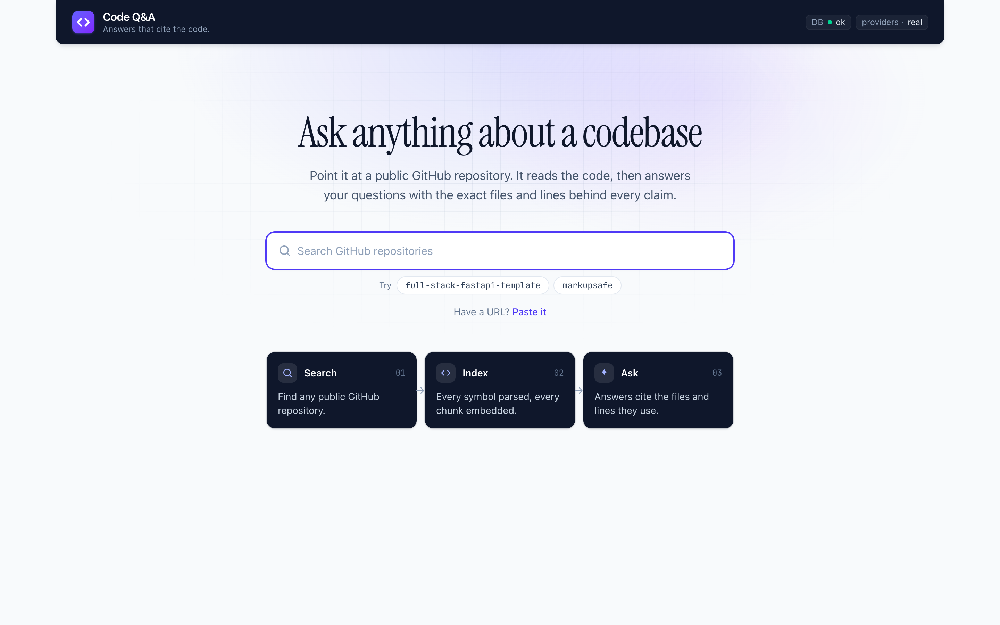

**2. Search results.** GitHub search, five results, with size and language shown before anything is cloned.

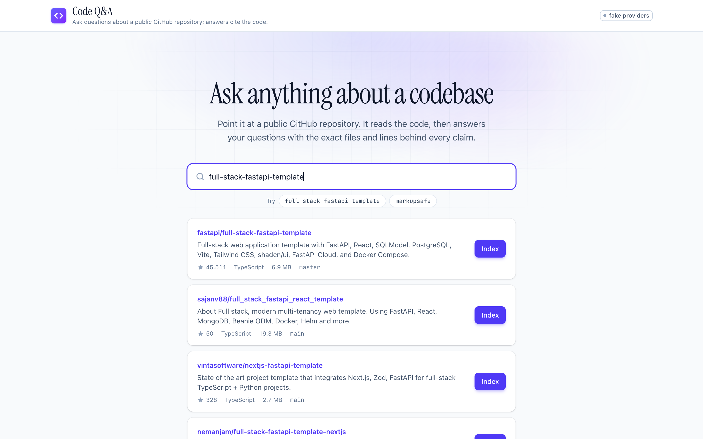

**3. Indexing.** The job's stages as they run: clone, walk, parse and chunk, embed, summary. Counts update from the job's own progress writes.

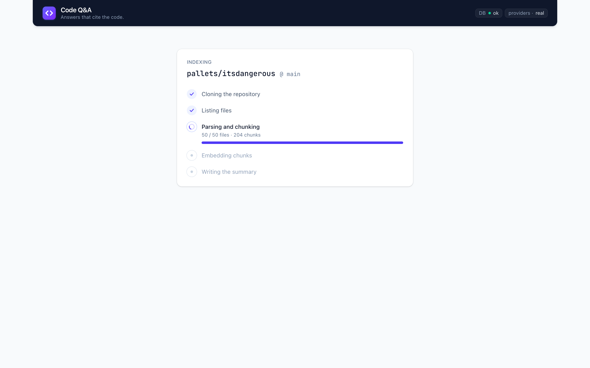

**4. Repository ready.** The sidebar: commit, summary, files and chunks, the language split, and four suggested questions written from the README and the tree. "Details" holds the rest.

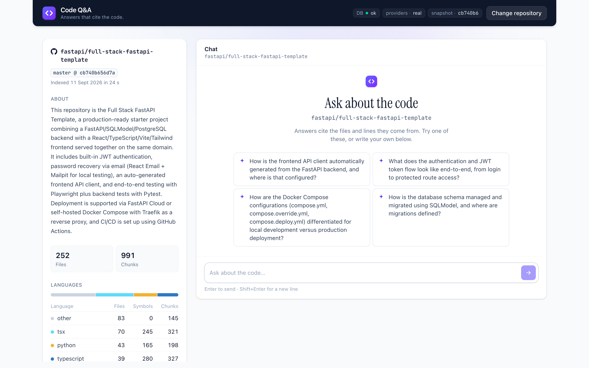

**5. Answering.** The in-flight state; a full answer takes roughly ten seconds.

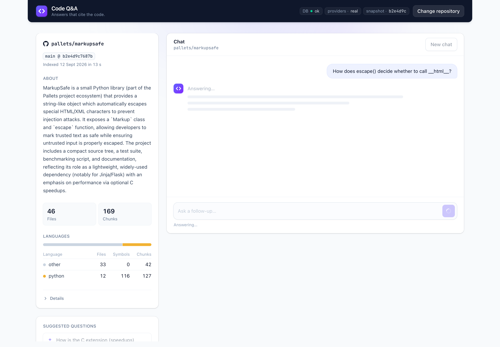

**6. An answer with sources.** Citation chips at the end of the answer; each source card shows the file and lines, the symbol, how it was found (symbol, keyword, vector), the code with real line numbers, a GitHub link at the indexed commit, and "Ask about this."


**7. The trace.** Which retrieval legs fired and with how many hits, per-stage timings, tokens in and out, cache reads, and the snapshot answered from.

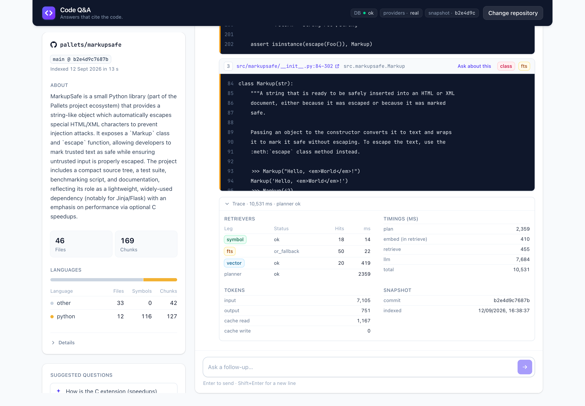

**8. Not found.** A question the repository can't answer. The badge is a state, not an error, and the thumbs-down feeds the eval tooling.

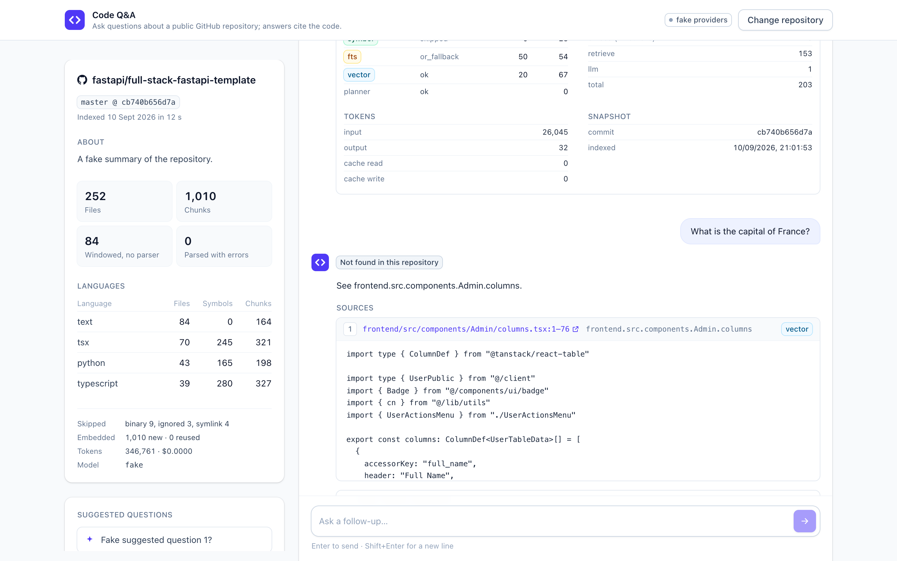

**9. An error.** A pasted URL that isn't a GitHub repository: the error contract's `detail` and `code`, inline.

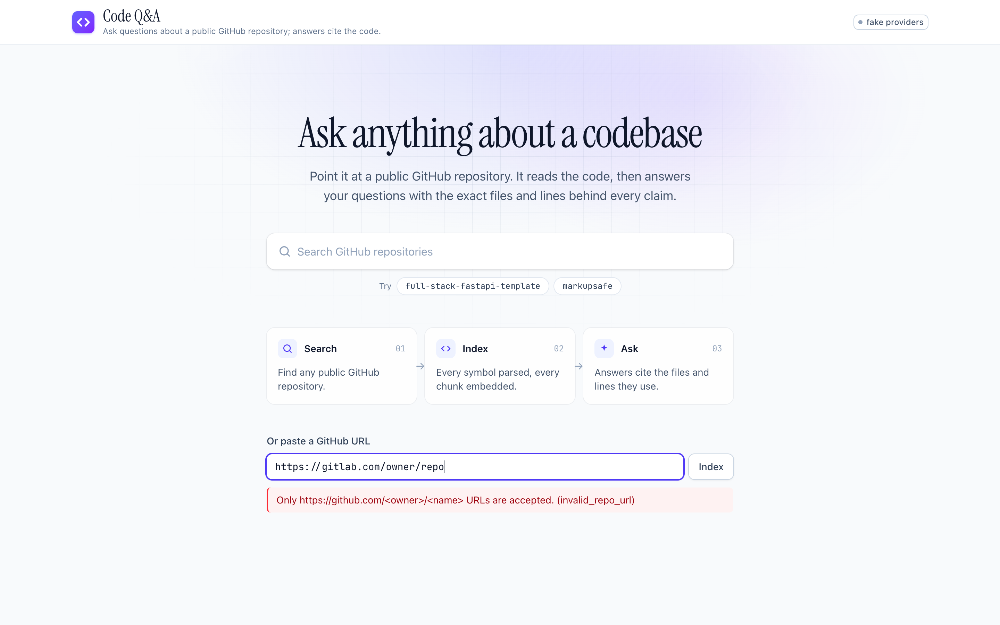

**10. As a tool.** The same service used from Claude Code through the MCP server.

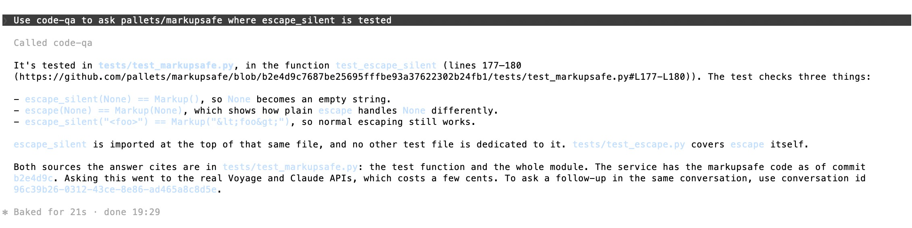

**11. API docs.** Every route, every error code, at `/docs`.

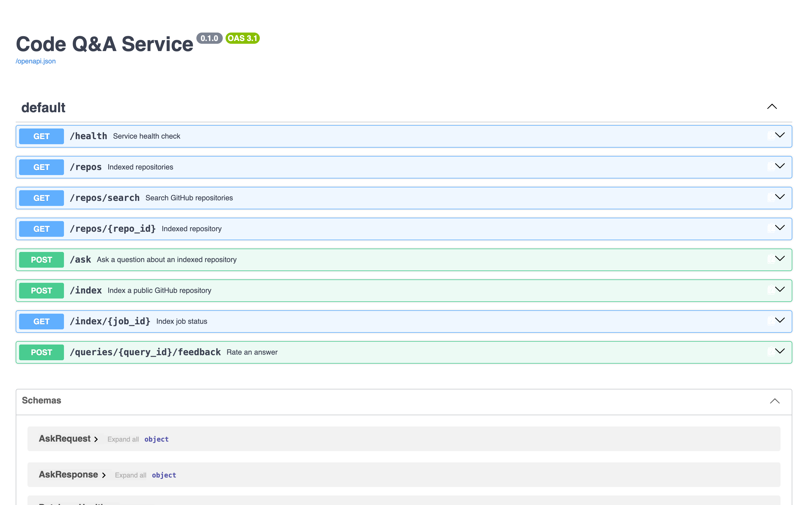

**12. Mobile.** The sidebar stacks above the chat.

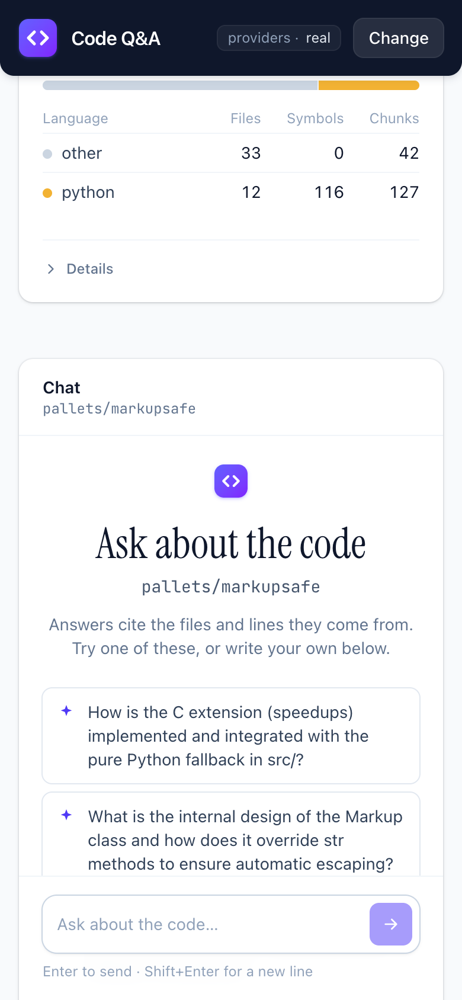

---

## Evals and numbers

`fastapi/full-stack-fastapi-template` pinned at `cb740b656d7a`, run `20260911T131304Z`:

| # | Question | Expect | Result | Rank | Tier |
|---|---|---|---|---|---|
| 1 | What does this project do? | README.md | miss | — | — |
| 2 | Where is the login endpoint defined? | backend/app/api/routes/login.py :: login_access_token | hit | 3 | vector |
| 3 | How do route handlers get a database session? | backend/app/api/deps.py :: get_db | hit | 1 | symbol |
| 4 | Which routers make up the API? | backend/app/api/main.py | hit | 1 | vector |
| 5 | What fields does the User model have? | backend/app/models.py :: User | hit | 1 | symbol |
| 6 | How are passwords hashed? | backend/app/core/security.py :: get_password_hash | hit | 4 | vector |
| 7 | What does `crud.authenticate` do? | backend/app/crud.py :: authenticate | hit | 1 | symbol |
| 8 | How is the current user resolved from the token? | backend/app/api/deps.py :: get_current_user | hit | 2 | vector |
| 9 | What are the backend's dependencies? | backend/pyproject.toml | miss | — | — |
| 10 | Where is the password-reset email built? | backend/app/utils.py :: generate_reset_password_email | hit | 1 | vector |
| 11 | Where is the login page defined? | frontend/src/routes/login.tsx | hit | 1 | symbol |
| 12 | Which hook manages authentication state? | frontend/src/hooks/useAuth.ts | hit | 1 | fts |
| 13 | Where is the Stripe integration? | not found | not found ✓ | — | — |
| 14 | What does `crud.authenticate` do? → what about its tests? | backend/tests/crud/test_user.py | hit | 1 | fts |

hit@5: 11 / 13. Not-found: 1 / 1.

Per question (median, real providers): 12,170 ms end to end, 7,804 input tokens, $0.0292, cache read share 29.3%. Indexing the demo repository: 252 files, 991 chunks, 236,443 tokens embedded, $0.0284, in 24.05 s.

Two things the runs showed that a single number would hide. First, hit@5 moves by one case between runs with no code change, because the planner's rewrite varies; the report keeps a paired comparison (same plans, retrieval change on and off) to isolate what a change actually did. Second, the two misses are the only non-code targets, the README and `pyproject.toml`. Adding the file path's tokens to the lexical index was tried, measured and reverted: "backend" sits in the top-weighted field of a fifth of the chunks, so it diluted ranking rather than sharpening it. In practice the README question is answered correctly anyway, because the repository summary is in the prompt.

Full report, including the reverted experiment and the floor calibration: [`docs/evals/2026-09-11.md`](docs/evals/2026-09-11.md).

---

## How I used AI tools

**Tools.** Claude Code on a Max subscription for all of the code; Claude (chat) as a design partner before any code existed. The product's own API keys were not touched until the last phase.

**The spec came first.** Before opening Claude Code there were two files: `PLAN.md`, eleven phases with the files, tests, done-when and commit sequence for each, and `CLAUDE.md`, the working rules: module layout, style, testing, git, security, cost, and a list of don'ts. Both came out of a long design conversation, and both are in the repo as they were used.

**One phase at a time, plan mode first.** Each phase started with "enter plan mode and propose the commits." I read the plan, answered its questions (where does conversation history live, what happens when a job is interrupted by a restart, which retry rules apply to which call), corrected what needed correcting, and only then let it write code. Between phases, `/compact`.

**Small green commits.** Every commit passed `make check` before it was made. A phase was three to six commits with conventional messages. The history is part of the submission; nothing was squashed. Seventy-two commits in total.

**Fakes until the end.** `PROVIDERS=fake` wires deterministic fakes for embeddings and the model into the running app, so the whole stack including the interface was built and exercised at zero cost. The first real API call was the smoke test in the last phase, and total real-provider spend for the whole build was under a dollar.

**What the process caught that a green test suite did not.**
- The dev server's file watcher included the directory clones land in, so every index job triggered a reload. Found by looking at a screenshot where the progress stages never appeared; fixed with one flag.
- tree-sitter 0.26.0 corrupts memory on one file in `pallets/markupsafe`. Found by the manual check on a real repository; pinned with the reproduction recorded.
- `bun.lock` was being indexed as eighty windows of hashes. Found by reading the data in a screenshot, not the code.
- The relevance floor was calibrated for fake vectors and badged a correct answer "not found." Found in the first real-mode walkthrough; recalibrated from the golden set's cosine scores.
- A 3-second planner timeout tripped at 3,049 ms and silently lost a follow-up's identifiers. Found by reading the trace of a missed question; the setting now carries the measured range.
- A source retrieved for the current turn that was also replayed from history made the model stop citing. Found by comparing traces across four turns; the briefing now sends each source once.

**Do's.**
- Write the plan and the rules before the first prompt, and keep them in the repo.
- Make the model ask its questions before it writes; the questions are where the design gets tested.
- Keep the deliverable boundary explicit: the README is mine, the code is reviewed, the tests are the contract.
- Give it fakes and a switch, so building never spends.
- Look at what it produces, screenshots and traces included, with the same attention as code. Most of the last day's fixes came from there.
- Keep every experiment reversible and measured: two of the citation experiments were run, measured, and backed out with an empty diff.

**Don'ts.**
- Don't let it invent design decisions; when the plan is silent, it stops and asks.
- Don't accept a new dependency without a reason it can state; two were refused (a test runner, an SDK that pulled in a framework).
- Don't let it run anything that costs money without saying the cost first.
- Don't let it read outside the repository.
- Don't squash the history to look tidier than the work was.

---

## Limitations, next steps, and what I'd do differently

- The citation check catches references to sources that were not in the briefing; it cannot catch a real source cited for a claim it does not support. That needs an LLM judge, and it is the first thing I would add.
- Follow-up questions depend on the planner's rewrite; when it falls back, a bare "what about its tests?" retrieves poorly.
- Vague follow-ups ("where is *that* tested?") sometimes come back correct but uncited: the model returns no citation blocks on that phrasing, under two different briefing structures. The interface shows what was retrieved instead of hiding it. The one lever not yet tried is sending the planner's rewritten question to the model in place of the original.
- Answers vary in shape between runs; the facts and the citations don't. That is why the eval measures retrieval rather than wording.
- TypeScript is parsed into symbols but call graphs are not modelled; an unclosed parenthesis folds the rest of a TypeScript file into one error region.
- Languages without a query file (Go, Rust, PHP, …) are indexed as windows. Each is a grammar wheel, a twenty-line query, a fixture and a test.
- Answers to broad questions run long; the prompt limits transcription of code, not length.
- No streaming, no authentication, no rate limiting.
- Answers cost about five cents each at the current briefing size; `ANSWER_FULL_HITS` and `ANSWER_INDEX_LINES` are settings for tuning that down.

With more time, in order: the LLM judge, streaming, per-repo partial indexes, incremental parsing, a reranker, and one more language to prove the recipe.

What I'd do differently:

- **A worker container from the start.** `BackgroundTasks` is the right size for a demo, but a second compose service running the same image costs an hour and removes two limitations at once: per-job isolation bounds parse time properly, and index jobs stop sharing a process with the API. It is the first structural change I would make.
- **Write the golden set before the retrieval code.** It changed how full-text search was built (AND first, OR as a fallback) and would have shaped the retrievers from the start.
- **A smaller default briefing.** Twelve full chunks is more than most questions need; I would start at eight and let the evals argue it up.

---

## Where each part of the brief lives

| Brief | Section |
|---|---|
| a. Quick setup | Quick start |
| b. Architecture | Architecture |
| c. Productionize, scale, deploy | Productionizing, scaling and deployment |
| d. RAG/LLM approach and decisions | RAG and LLM decisions at a glance; Design decisions and trade-offs |
| e. Key technical decisions | Design decisions and trade-offs |
| f. Engineering standards followed and skipped | Quality choices |
| g. AI tools in the process | How I used AI tools; `CLAUDE.md` and `PLAN.md` as used |
| h. With more time | Limitations, next steps, and what I'd do differently |
| Screenshots and video | Design and product; `docs/screenshots/` |
| Agents and MCP | Use it as a tool; Design decisions (why no agent loop) |
| Chunking · embeddings · LLM · retrieval · prompts · context · guardrails · quality · observability | RAG and LLM decisions at a glance |

---

## Project structure

```
code-qa-service/
├── app/
│   ├── api.py            # all route handlers
│   ├── answering.py      # briefing, Claude call, citation check, ask()
│   ├── chunking.py       # symbol chunks, windows, parts, content hash
│   ├── config.py         # Settings via pydantic-settings
│   ├── db.py             # psycopg pool, migrations runner
│   ├── embeddings.py     # VoyageEmbeddings over httpx, FakeEmbeddings
│   ├── errors.py         # exception hierarchy + FastAPI handlers
│   ├── github.py         # URL validation, search proxy, shallow clone, file walk
│   ├── indexing.py       # _run_index(): clone → parse → chunk → embed → summary → activate
│   ├── jobs.py           # Job dataclass + Postgres JobStore
│   ├── llm.py            # ClaudeLLM (structured, complete), FakeLLM
│   ├── logging_setup.py  # structlog JSON config + request_id contextvar
│   ├── main.py           # FastAPI app, lifespan, middleware, SPA mount
│   ├── mcp_server.py     # FastMCP server: list_repos, repo_info, ask (thin HTTP client)
│   ├── parsing.py        # tree-sitter language table, file_symbols()
│   ├── planning.py       # planner: standalone query, identifiers, intent
│   ├── retrieval.py      # three legs, RRF, part collapse, relevance floor
│   ├── schemas.py        # Pydantic request/response models
│   ├── store.py          # ChunkStore: snapshots, upserts, search queries, queries log
│   ├── summary.py        # repo summary + suggested questions at index time
│   ├── migrations/       # 0001_init.sql, 0002_conversations.sql, 0003_feedback.sql
│   └── queries/          # python.scm, javascript.scm, typescript.scm
├── web/                  # Vite + React + Tailwind, built into app/static
│   ├── public/fonts/     # Instrument Serif, JetBrains Mono, vendored under the OFL
│   └── src/
│       ├── components/   # RepoSearch, IndexProgress, Chat, Sources, Trace
│       ├── App.tsx       # page state: search → index → repo, header pills
│       ├── api.ts        # fetch wrapper ({detail, code} → ApiError) and the response types
│       └── index.css     # Tailwind theme: tokens, tier colours, component classes
├── evals/
│   ├── golden.json       # 13 questions + 1 conversation, pinned to a commit
│   ├── run_evals.py      # hit@5, best cosine, latency and cost report
│   └── smoke.py          # index a small repo, ask one question
├── tests/                # one file per module, test_mcp.py included; fixtures/ py_app, ts_app, github
├── docs/
│   ├── mcp.md            # Claude Code and Cursor configuration
│   ├── evals/            # committed eval reports
│   └── screenshots/
├── docker/postgres/      # creates the codeqa_test database
├── .claude/              # settings.json (hooks), skills/add-eval-case
├── .github/              # ci.yml, dependabot.yml
├── CLAUDE.md             # working rules used by Claude Code
├── PLAN.md               # the eleven-phase plan, as executed
├── Dockerfile            # node build stage, uv build stage, slim runtime
├── docker-compose.yml    # db (pgvector) + api
├── Makefile
├── pyproject.toml
└── uv.lock
```

---

## License

MIT — see [LICENSE](LICENSE).
